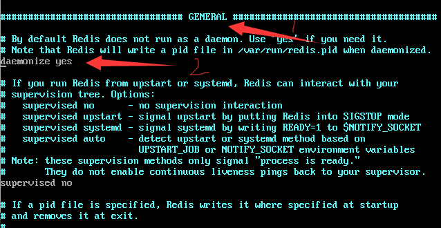
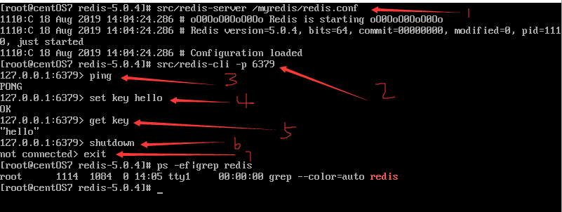

### 一：简介

是完全开源免费的，用C语言编写的，遵守BSD协议，是一个高性能的(key/value)分布式内存数据库，基于内存运行并支持持久化的NoSQL数据库，是当前最热门的NoSql数据库之一，也被人们称为数据结构服务器。

###  二：安装Redis5.0.4

1. 下载

   ```shell
   # 切换目录(所有第三方软件都放在opt)
   cd opt
   # 下载 
   wget http://download.redis.io/releases/redis-5.0.4.tar.gz
   # 如果过 wget 命令出错，执行：
   yum -y install wget
   # 再次下载
   wget http://download.redis.io/releases/redis-5.0.4.tar.gz
   ```
   
2. 解压

   ```shell
   tar -xzvf redis-5.0.4.tar.gz
   cd redis-5.0.4
   ```
   
3. 安装gcc编译工具

   ```shell
   # 查看gcc目前版本
   gcc -v
   # 如果gcc -v找不到任何东西则安装gcc，如果有则跳过此步骤直接进行第4步
   yum -y install gcc
   ```
   
4. 编译源码

   ```shell
   # 编译
   make
   # make完成后继续执行
   make install
   ```
   
5. 配置后台运行

   *如果想后台启动。需要修改redis.conf文件*

   ```shell
   # 备份配置文件 redis.conf
   mkdir -p /myredis
   cp redis.conf /myredis/
   # 编辑
   vim /myredis/redis.conf
   # daemonize no    改为    daemonize    yes
   # protected-mode yes   改为   protected-mode no
   # 注释 bind
   ```
   
   如图（参考）：



6. 启动

   ```shell
   # 启动服务端
   src/redis-server /myredis/redis.conf
   # 启动客户端
   src/redis-cli -p 6379
   # 关闭 redis 服务
   shutdown
   exit
   ```

   

   

